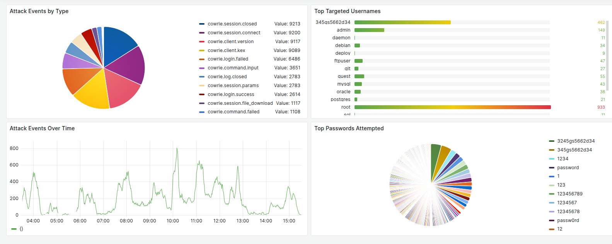

# Threat Intelligence Lab

Automated threat intelligence platform combining SSH honeypot deployment, real-time log analysis with Loki/Grafana, and automated malware detection via VirusTotal integration.

## Overview

This project demonstrates end-to-end threat detection and malware analysis capabilities through a production-grade honeypot deployment. The system captures real-world SSH attacks, analyzes attacker behavior patterns, and automatically identifies malware samples using threat intelligence feeds.

## Architecture

**Components:**
- **Cowrie SSH Honeypot** - Captures live SSH attack traffic on port 22
- **Loki + Grafana** - Real-time log aggregation and visualization
- **Promtail** - Log shipping and parsing
- **VirusTotal Integration** - Automated malware hash analysis via Python script
- **Ubuntu 24.04 LTS** - Hardened server deployment

**Security Configuration:**
- Real SSH service relocated to high port with IP-restricted firewall rules
- Cowrie exposed on port 22 to maximize attack surface for intelligence gathering
- UFW firewall configured for defense-in-depth
- Root login disabled, key-based authentication enforced

## Deployment

### Prerequisites
- Ubuntu 24.04 LTS server
- Docker and Docker Compose installed
- Minimum 4GB RAM recommended

### Quick Start

1. **Clone the repository**
```bash
git clone https://github.com/martypoland/threat-intelligence-lab.git
cd threat-intelligence-lab
```

2. **Deploy Cowrie honeypot**
```bash
# From the repository root
docker-compose up -d
```

3. **Deploy Loki/Grafana stack**
```bash
cd loki/
docker-compose up -d
```

4. **Configure VirusTotal monitoring**
```bash
cd virustotal/

# Edit the script and add your credentials
nano vt_monitor.py
# Set: VT_API_KEY, EMAIL_FROM, EMAIL_PASSWORD, EMAIL_TO

# Make executable
chmod +x vt_monitor.py

# Run in background for continuous monitoring
sudo nohup python3 vt_monitor.py > vt_monitor.log 2>&1 &
```

See [`virustotal/README.md`](virustotal/README.md) for detailed setup instructions.

### Security Hardening

Before exposing the honeypot to the internet:
- Move SSH to a non-standard high port (e.g., 52847)
- Disable root login and password authentication
- Configure UFW firewall to restrict management access
- Only expose port 22 (honeypot) to public internet

### Cowrie Honeypot Setup

**Docker Compose Configuration:**

See [`docker-compose.yml`](docker-compose.yml) for the complete configuration.

**Key Configuration:**
- Honeypot exposed on port 22 (standard SSH port for maximum attack exposure)
- Persistent volumes for configuration and log data
- Automatic restart on failure for continuous operation

**Deployment:**
```bash
docker-compose up -d
```

### Log Analysis with Loki/Grafana

**Architecture:**
- **Loki** - Log aggregation and storage
- **Promtail** - Log shipping from Cowrie to Loki
- **Grafana** - Visualization and dashboard interface

**Configuration Files:**
- [`loki/docker-compose.yml`](loki/docker-compose.yml) - Complete stack deployment
- [`loki/loki-config.yml`](loki/loki-config.yml) - Loki server configuration
- [`loki/promtail-config.yml`](loki/promtail-config.yml) - Log parsing and shipping

**Deployment:**
```bash
cd loki/
docker-compose up -d
```

**Access Grafana:**
```bash
# Via SSH tunnel (firewall blocks direct access)
ssh -L 3000:localhost:3000 -p YOUR_SSH_PORT user@YOUR_SERVER_IP
```

Then access at `http://localhost:3000` (default credentials: admin/admin)

**Dashboard Visualizations:**



The dashboard provides real-time analysis of:
- Attack volume over time showing peak activity periods
- Event type distribution (logins, commands, file downloads)
- Most targeted usernames and credentials
- Top attack source IP addresses
- Commands executed by attackers

See additional screenshots in [`screenshots/`](screenshots/) folder.

## Attack Analysis

This honeypot captured **18,974 attack events** from **129 unique IP addresses** over 3 days, with 11 malware samples downloaded.

**Key Findings:**
- 50% of attacks targeted root account
- Coordinated botnet activity using paired credentials
- SSH backdoor installation attempts observed

See detailed analysis in [Attack Report](findings/attack-report.md)

## Malware Samples

The honeypot captured **11 malware samples** including:

- **Cryptocurrency mining trojan** (29MB, 44/65 detection rate on VirusTotal)
- **Mirai botnet variants** across 5 different CPU architectures (x86, x86-64, ARM, ARM64)
- **Installation scripts** demonstrating evasion techniques and competitor removal
- **SSH backdoor keys** for persistent access

**Key Findings:**
- Multi-architecture deployment indicates targeting of IoT devices and embedded systems
- Botnet warfare observed: malware actively removes competing infections
- Failed C2 communication to `XXX.XXX.XXX.XXX` suggests disrupted infrastructure

See detailed analysis in [Malware Analysis Report](findings/malware-analysis.md)

## Skills Demonstrated

- Honeypot deployment and configuration
- Log aggregation and analysis (Loki/Grafana)
- Security automation (Python scripting)
- Threat intelligence integration (VirusTotal API)
- Linux system hardening
- Docker containerization
- Firewall configuration and network security
- Malware analysis techniques

## Future Enhancements

- [ ] Geographic attack visualization
- [x] Automated alerting for malware detection *(Completed - email alerts via VirusTotal integration)*
- [x] Integration with additional threat intel feeds *(Completed - VirusTotal API)*
- [ ] Machine learning for attack pattern recognition

## License

MIT License
